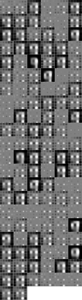

# DRAW
Torch implementation of DRAW: A Recurrent Neural Network For Image Generation, based on https://github.com/vivanov879/draw

Implementation not completed. Now results are rather random. 

Results:
-----------------------
Result for the reconstruction:

Results for the generation:

The model used for producing gif have been learning by 4 hours then it stop converging

TODO:
-----------------------
- add normalization to filter back: DONE
- use different AttentionRead and AttentionWrite filter size: DONE
- get similar results to https://github.com/jbornschein/draw (using same architecture)

Changes compared to https://github.com/vivanov879/draw
-----------------------
- added batch learning
- more modular code, most of the element have own file
- added cuda support
- addded command line arguments
